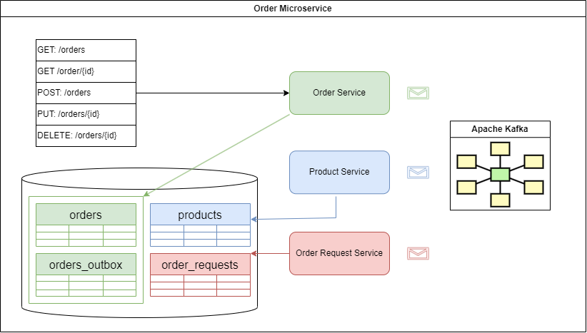

# Order Management Microservice
## Project Description
Order Management Service is the project implements Event-Driven Architecture.</br>
It provides CRUD operations for a order.</br>
It uses kafka message broker where it sends event about order creation.
To overcome Dual Writing problem we also implement Outbox pattern.

### Visual


### Installation requirements
In order to start up the application you need have installed:
- Docker on you machine </br>
- git 

### Installation steps
The project installation could be done using docker-compose.yml via command line interface (CMD):
Unix/Linux:
```
git clone https://github.com/genadigeno/order-management.git &&
cd order-management &&
docker compose up
```
Windows:
```
git clone https://github.com/genadigeno/order-management.git &&
cd order-management &&
docker compose up
```

### JVM Parameters
- `SERVER_PORT` - application port number, default: 8282
- `KAFKA_BOOTSTRAP_SERVERS` - kafka cluster url, default: localhost:9092,localhost:9093
- `KAFKA_ORDER_TOPIC_NAME` - kafka topic name, default: orders.topic
- `KAFKA_ORDER_DLT_TOPIC_NAME` - kafka dead letter topic name, default: orders.topic
- `KAFKA_SUCCESSFUL_ORDER_TOPIC_NAME` - topic name for successful ordering operation
- `KAFKA_FAILED_ORDER_TOPIC_NAME` - topic name for failed ordering operation 
- `POSTGRES_URL` - postgres url
- `POSTGRES_USER` - postgres order
- `POSTGRES_PASSWORD` - postgres password
#### Example `java -DPOSTGRES_URL=jdbc:postgresql://localhost:5432/order_management?currentSchema=gvggroup -DPOSTGRES_USER=postgres -DPOSTGRES_PASSWORD=secret -jar ./target/accident-event-stream.jar`
